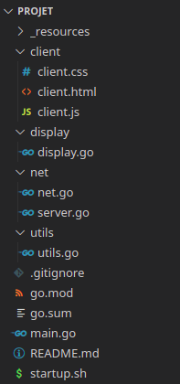
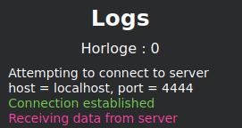

# SR05 Projet de programmation P23

Bordeau Oceane, Gharbi Wassim, Scheidler Nicolas, Schneider Martin

## Presentation

Notre projet permet d'accèder à un document texte en lecture/écriture depuis plusieurs sites de manière simultanée. L'édition de ce document correspond à la section critique du programme. La communication des sites est assurée par le biais d'un anneau.
Pour répondre à nos objectifs, un algortihme réparti a été implémenté. Celui-ci est composé de plusieurs algortihmes fondamentaux :

- Un algorithme de file d'attente : pour coordonner les demandes d'entrée en section critique entre les différents sites ;
- Un algorithme de sauvegarde : pour capturer un instantané cohérent de l'état de l'éxécution (document, demandes en attente, traffic réseau).

Une interface web est également accessible.

## Installation

Tout d'abord, il est necessaire d'importer le projet sur votre machine.

Vous pouvez cloner le repo Github :

```sh
$ git clone https://github.com/martinschnder/projet_sr05.git
```

ou décompresser l'archive tar.

Voici l'arborescence que vous devriez avoir :

<p align="center">
  
</p>

## Lancement

Compilez le projet à sa racine pour obtenir un executable avec la commande suivante :

```sh
$ go build
```

Un éxécutable "projet" devrait apparaître.

Exécuter le script startup.sh :

```sh
$ ./startup.sh
```

Il execute une instance du projet par site et les met en réseau en anneau grâce à la commande :

```sh
./projet -id 0 -port 2222 < /tmp/f | ./projet -id 1 -port 3333 | ./projet -id 2 -port 4444 > /tmp/f
```

Ici, nous créons 3 sites distincts sur 3 ports : 2222, 3333, 4444.

Ouvrir les interfaces web avec autant de pages que de sites (3 ici) :

```sh
$ firefox client/client.html
```

Sur chaque interface, connectez les websockets (sur les ports 2222, 3333, 4444).

Une fois la websocket connectée, vous devriez obtenir des logs semblables sur l'interface :

<p align="center">
  
</p>

## Utilisation

Avec le visuel du document, vous pouvez suivre son état. Depuis chaque site, vous pouvez éditer le document :

- Ligne : Selectionner le numéro de la ligne que vous souhaitez modifier ;
- Action : Choisisser ce que vous voulez faire sur cette ligne (Remplacer, Ajouter ou Supprimer), ajouter permet d'ajouter à une ligne du texte ;
- Texte : Entrer le texte que vous voulez.

Vous pouvez vérifier qu'une action sur un site entraîne la modification de chaque réplicats sur tous les sites.

Enfin vous pouvez réaliser un snapshot. Le clic sur le bouton "Faire un snapshot" génére un fichier "snapshot.txt".

## Communication

### Communication entre un serveur et son client

Dès lors que le client souhaite envoyer un message à son serveur, il construit une commande au format `/=line=.../=action=.../=message=...` et l'envoi à travers la websocket.

Lorsque le serveur souhaite envoyer un message à son client, il construit un objet JSON comprenant le texte du document et l'horloge.

### Communication entre les différents sites

Les différents sites sont connectés au travers d'un anneau, lorsqu'un site souhaite communiquer avec les autres, il envoie sur son canal `stdout` un message au format `|=From=...|=To=...|=Content=...|=Stamp=...|=MessageType=...|=VectClock=...|=Color=...`

Sur chaque site une goroutine `ReadMessage` s'occupe de lire ce qui arrive sur le canal `stdin` et la passe dans un canal de communication `messages` propre au site. La goroutine `MessageHandler` s'occupe de lire ce qui arrive sur ce canal de communication et de le traiter (en fonction de s'il lui est destiné ou non).

Si un site souhaite envoyer un message à un autre site, alors il utilise la fonction `writeMessage` qui écrira dans le canal de communication `messages` pour que `MessageHandler` le propage aux autres sites.

## Implémentation des algorithmes

### File d'attente

Le code a été écrit en se basant sur l'[algorithme](https://moodle.utc.fr/pluginfile.php/172574/mod_resource/content/1/5-POLY-file-attente-2018.pdf) de file d'attente répartie du cours.

La file d'attente se base sur les deux attributs de la classe net :

- `clock int` : horloge logique du site ;
- `requestTab [NB_SITES]Request` : etat des requetes de demandes d'accès en section critique.

A partir de l'algorithme du cours, des méthodes ont été écrites :

- `func (n *Net) ReceiveCSRequest()` : Envoi d'une requete d'accès au document partagé
- `func (n *Net) receiveCSRelease()` : Envoi d'une requete de libération du document partagé
- `func (n *Net) receiveRequestMessage(received_msg Message)` : Traitement d'une requete d'accès au document partagé reçue
- `func (n *Net) receiveReleaseMessage(msg Message)` : Traitement d'un message de liberation du document partagé reçu
- `func (n *Net) receiveAckMessage(msg Message)` : traitement d'un message d'acquittement reçu
- `func (n *Net) isValidRequest() bool` : Comparaison des estampilles pour valider que le site a emis la requete la plus vieille et peut donc accéder à la section critique

Enfin, nous avons pu implémenter le programme en déroulant l'algorithme du cours.

## Snapshot

Le code a été écrit en se basant sur l'algorithme d'instantané avec reconstitution de configuration ([algorithme 11](https://moodle.utc.fr/pluginfile.php/310410/mod_resource/content/1/5-poly-06-2019S.pdf)).

Les snapshots se basent sur les attributs suivants de la classe net :

- `color string` : Couleur du site
- `initator bool` : Site initiateur du snapshot (faux si c'est un autre site)
- `nbExpectedStates int` : Nombre d'états devant être reçus
- `nbExpectedMessages int`: Nombre de messages devant être reçus
- `state *State`: Etat local du site
- `globalState *list.List`: Etat Global

A partir de l'algorithme, des méthodes ont été écrites :

- `func (n *Net) InitSnapshot()` : Début de l'instantané
- `func (n *Net) receiveStateMessage(msg Message)` : Reception d'un message de type état
- `func (n *Net) receivePrepostMessage(msg Message)` : Réception d’un message prepost
- `func (n *Net) reinitializeAfterSnapshot()` : Réinitialisation du site initiateur du snapshot après ce dernier
- `func (n *Net) receiveEndSnapshotMessage()`: Réinitialisation après la fin d'un snapshot

Enfin, nous avons pu implémenter le code en déroulant l'algorithme.

## Documentation

### Package display : Affichage des logs sur le canal stderr

- Fonctions des logs :
  - `func Info(id int, where string, what string)` : Log d'information
  - `func Warning(id int, where string, what string)` : Log d'avertissement
  - `func Error(id int, where string, what string)` : Log d'erreur
- Variables :
  - `var rouge string`
  - `var orange string`
  - `var raz string`
  - `var cyan string`
  - `var pid` : id du processus
  - `var stderr` : logger correspondant à stderr

### Package net

- net.go

  - Attributs

  ```go
  type Net struct {
      id int
      clock int
      requestTab [NB_SITES]Request
      messages chan MessageWrapper
      server *Server
      color string
      initator bool
      nbExpectedStates int
      nbExpectedMessages int
      state *State
      globalState *list.List
  }
  ```

  - Methodes
    - `NewNet(id int, port string, addr string) *Net` : Constructeur d'un site
    - `func (n *Net) ReceiveCSRequest()` : Envoi d'une requete d'accès au document partagé
    - `func (n *Net) receiveCSRelease()` : Envoi d'une requete de libération du document partagé
    - `func (n *Net) receiveExternalMessage(msg Message)` : Appel de la fonction approprié selon le type du message
    - `func (n *Net) receiveRequestMessage(received_msg Message)` : Traitement d'une requete d'accès au document partagé reçue
    - `func (n *Net) isValidRequest() bool` : Comparaison des estampilles pour valider que le site a emis la quete la plus vieille et donc peut accéder à la section critique
    - `func (n *Net) receiveReleaseMessage(msg Message)` : Traitement d'un message de liberation du document partagé reçu
    - `func (n *Net) receiveAckMessage(msg Message)` : Traitement d'un message d'acquittement reçu
    - `func (n *Net) receiveStateMessage(msg Message)` : Traitement d'un message de type état
    - `func (n *Net) receivePrepostMessage(msg Message)` : Traitement d'un message de type prepost
    - `func (n *Net) reinitializeAfterSnapshot()` : Réinitialisation du site initateur après le snapshot
    - `func (n *Net) receiveEndSnapshotMessage()`: Réinitialisation du site après le snapshot
    - `func (n *Net) ReadMessage()` : Lit les messages sur l'entrée standard et les envoie ensuite sur le channel de communication du site pour qu'ils soient traités par MessageHandler().
    - `func (n *Net) writeMessage(msg Message)` : Ajout d'un message sur le canal de communication. Le message sera envoyé aux autres sites par MessageHandler()
    - `func (n *Net) MessageHandler()` : Lit les messages reçu et les traite s'il sont destinés à ce site. Propage les messages qui sont destinés aux autres sites
    - `func (n *Net) SendMessageFromServer(msg Message)` : Fonction utilisée pour envoyer un message depuis le client
    - `func (n *Net) InitSnapshot()` : Initialisation d'un snapshot

- server.go
  - Attributs
  ```go
  type Server struct {
      socket *websocket.Conn
      text []string
      id int
      net *Net
      command Command
  }
  ```
  - Methodes
    - `func NewServer(port string, addr string, id int, net *Net) *Server` : Constructeur d'un serveur
    - `func (server *Server)createSocket(w http.ResponseWriter, r *http.Request)` : Creation de la websocket
    - `func (server *Server)Send()` : envoi d'un message au format JSON au client
    - `func (server *Server)closeSocket()` : fermeture de la websocket
    - `func (server *Server)receive()` : reception d'un message du client
    - `func (server *Server)EditText(command Command)` : modification du texte du document avec la comande reçue
    - `func (server *Server)forwardEdition(command Command)` : propage la commande de modification du texte aux autres sites
    - `func (server *Server)SendMessage(action string)` : modifie le texte, le propage aux autres sites et demande la libération de la section critique si le site est le demandeur de la section critique

### Package utils

- Type :

  ```go
  type Message struct {
  	From        int
  	To          int
  	Content     string
  	Stamp       int
  	MessageType string
  	VectClock 	[]int
  	Color 		string
  }
  ```

  ```go
  type MessageWrapper struct {
  	Action  string
  	Message Message
  }
  ```

  ```go
  type Request struct {
  	RequestType string
  	Stamp       int
  }
  ```

  ```go
  type Command struct {
    Line int
    Action string
    Content string
  }
  ```

  ```go
  type State struct {
  Id int
  VectClock []int
  Text []string
  Review int
  }
  ```

  ```go
  type MessageToClient struct {
  Text []string
  Stamp int
  }
  ```

- Fonctions :
  - `func MessageFromString(raw string) Message` : Transforme une string en un object Message
  - `func (msg Message) ToString() string` : Transforme un objet Message sous forme de string
  - `func vectClockToString(vectClock []int)` string : Transforme une horloge vectorielle en une string
  - `func vectClockFromString(raw string) []int` : Transforme une string en une horloge vectorielle sous forme de tableau
  - `func (s *State)VectClockIncr(otherClock []int, nbSites int)` : incrémente l'horloge vectorielle
  - `func (msg Message) ToStringForContent() string` : Transforme un objet Message en une string pour être intégrée dans le Content d'un autre Message
  - `func (msg Message) ConcernSnapshot() bool` : Renvoie vrai si le message concerne le snapshot
  - `func (msg Message) Send()` : Envoi d'un message formaté en string sur la sortie standard `stdout`
  - `func CommandFromString(raw string) Command` : Transforme une string en un objet Command
  - `func (command Command) ToString() string` : Transforme un objet Command en une string
  - `func NewState(id int, text []string, nbSites int) *State` : Constructeur d'un objet State
  - `func StateFromString(raw string) State` : Transforme une string en un objet State
  - `func (s *State) ToString() string` : Transforme un objet State en une string
  - `func textToString(text []string) string` : Transforme un texte en une string
  - `func textFromString(raw string) []string` : Transforme une string en un texte
